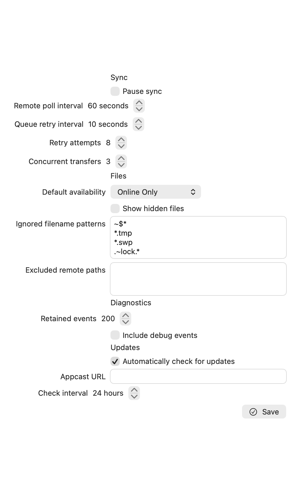
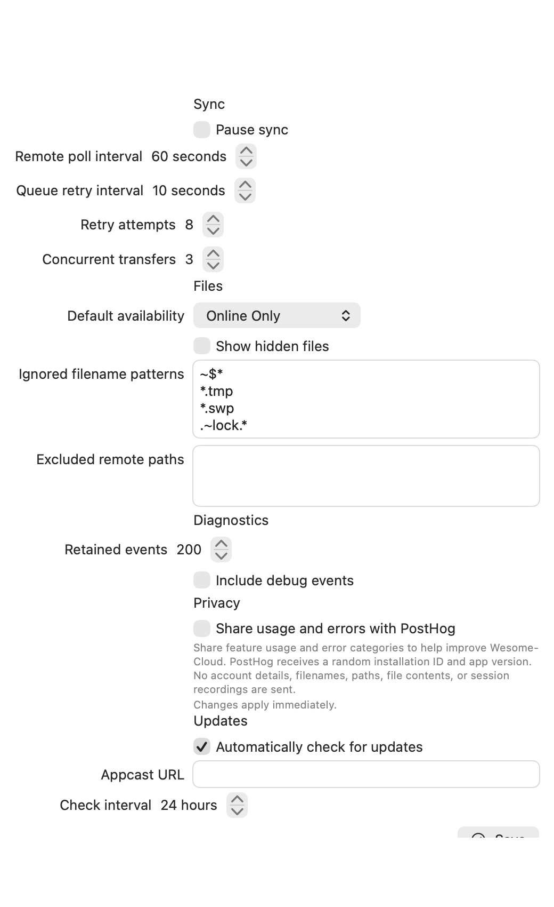
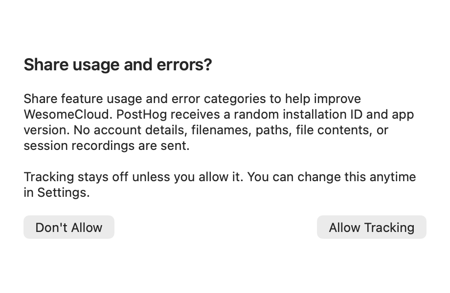

# Optional usage and error tracking

WesomeCloud asks before sending anything to PostHog. New installations and old
preferences without a tracking choice start with tracking off. Allow Tracking
persists approval before enabling requests. Don't Allow persists the refusal.
Settings > Privacy offers the same approval dialog and an immediate off switch.
Tracking changes do not require the general Settings Save button.

Only explicit feature actions and sanitized error categories are sent. Payloads
contain a random installation ID, event or operation name, timestamp, app version,
build number, and the platform name. No account IDs, usernames, server URLs,
filenames, paths, file contents, raw error messages, diagnostic logs, or recordings
are included. GeoIP enrichment and person-profile processing are disabled.
PostHog still receives the source IP as part of the network connection.

The installation ID persists while approved. Disabling tracking removes it;
approving again creates a new ID. It does not identify the same person across Macs.

## Transport and errors

The main app uses PostHog's [capture API](https://posthog.com/docs/api/capture)
with an ephemeral URLSession. There is no SDK autocapture, offline queue, retry,
feature-flag request, survey, or session replay. Failed sends are discarded.
Disabling tracking invalidates the session and cancels outstanding requests.
Requests already delivered cannot be recalled. HTTP redirects are refused.

Handled main-app failures are submitted in PostHog's `$exception_list` envelope,
with a sanitized category and operation. Raw messages and stack frames are omitted
because they can expose file paths and account details. New synchronization issues
are reported when the app reads them, once per approved session; issues that
predate that session are excluded. The File Provider extension does not send
telemetry. Native crashes and existing macOS crash reports are not uploaded.

## Configuration

The public project token and EU ingestion host are configured in `project.yml`:

- `WESOME_CLOUD_POSTHOG_PROJECT_TOKEN`
- `WESOME_CLOUD_POSTHOG_HOST`, currently `https://eu.i.posthog.com`

Xcode expands them into the main app's Info.plist. They can be overridden through
Xcode build settings. Empty tokens, unresolved placeholders, and invalid or
non-HTTPS hosts leave tracking inactive even if the user approved it.
The token is a public ingestion token, never a personal API key.

Regenerate the Xcode project after changing configuration. No PostHog project
settings or additional deployment credentials are required. Local tests intercept
requests and do not send events to the configured project.

## UI previews

These images render the actual native SwiftUI views with default preferences and
no connected accounts. They are view previews, not signed-app screenshots.
The before and after Settings views use the same 520 × 850 point viewport.
Settings now scrolls so the disclosure remains readable on smaller screens.

| Settings before | Settings after |
| --- | --- |
|  |  |

The consent journey was also exercised in an isolated native app using the actual
root view and in-memory repositories: decline, open Settings, request approval,
allow, and disable. This preview has no PostHog configuration or live accounts.
